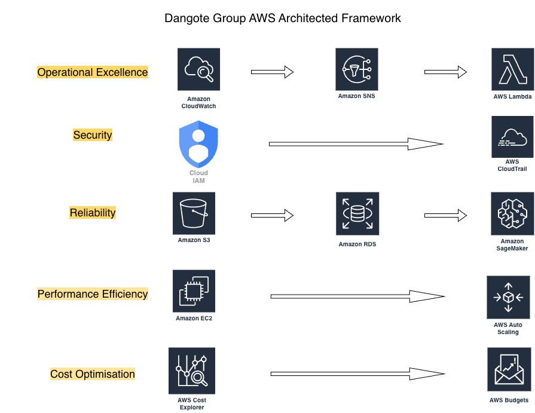

# Dangote Group AWS Well-Architected Framework Case Study

## Why I Built This

I started learning cloud computing while working night shifts, with the goal of moving into a Cloud AI Architect role. I already had Azure certifications and a background in content moderation and AI quality from my time at TikTok, but I wanted a project that proved I could think like an architect, not just follow a tutorial.

Instead of building a generic "e-commerce app on AWS" demo, I picked a real company, Dangote Group, and read actual 2026 news about the operational problems they are facing as they expand their refinery capacity: equipment failures, security across multiple countries, unpredictable supply chains, and the need to scale and control costs. I then designed an AWS solution for each of those real problems, structured around the official AWS Well-Architected Framework's five pillars.

This project also connects directly to my next step: an MSc in Data Science and Artificial Intelligence. Two parts of this build, the sentiment analysis on maintenance logs (Amazon Comprehend) and the shipping delay forecasting model (Amazon SageMaker Canvas), are both applied machine learning, and completing them hands on gave me a much clearer, practical understanding of what AI in a cloud environment actually looks like before starting the degree.

## Overview

This project is a 5-pillar AWS architecture case study built around real 2026 news about Dangote Group, a major Nigerian industrial conglomerate expanding its refinery operations. Rather than following a generic tutorial, this project identifies real operational challenges facing Dangote (equipment failures, security across multiple countries, unpredictable supply chains, scaling demands, and cost visibility) and designs AWS solutions for each one, structured around the official AWS Well-Architected Framework.

## Architecture Diagram



## The Five Pillars

### Pillar 1: Operational Excellence
**Goal:** Monitor refinery operations in real time and respond automatically to issues.

- **Amazon CloudWatch** — dashboard and alarms monitoring equipment health (CPU threshold alerts)
- **Amazon SNS** — sends email alerts when thresholds are breached
- **AWS Lambda** — automated incident response function (Python 3.12)
- **Amazon Comprehend** — sentiment analysis on maintenance logs to flag concerning language early

### Pillar 2: Security
**Goal:** Enforce least-privilege access and maintain a full audit trail.

- **IAM** — role-based users and groups (Operations, Finance, IT Admin) with scoped permissions
- **AWS CloudTrail** — multi-region logging of all account activity for audit and compliance

### Pillar 3: Reliability
**Goal:** Protect data and predict supply chain disruptions before they happen.

- **Amazon S3** — versioned backup storage with automated lifecycle rules (Standard-IA after 30 days, Glacier after 90)
- **Amazon RDS** — managed MySQL database for operational data
- **Amazon SageMaker Canvas** — forecasting model predicting shipping delays from supply chain data

### Pillar 4: Performance Efficiency
**Goal:** Scale compute resources automatically and remain available across data center failures.

- **EC2 Launch Template** — standardized server blueprint for refinery workloads
- **Auto Scaling Group** — automatically scales between 1-3 instances based on CPU utilization (70% threshold)
- **Multi-AZ deployment** — instances spread across two Availability Zones (us-east-1a, us-east-1b) for high availability

### Pillar 5: Cost Optimization
**Goal:** Track spending by project and catch cost overruns early.

- **Resource Tagging** — all resources tagged with Project, Department, Country, and Environment
- **AWS Cost Explorer** — visibility into cost and usage patterns by service
- **AWS Budgets** — monthly $5 budget alert with threshold notifications

## Repository Structure

```
dangote-aws-architecture/
├── README.md
├── dangote-architecture-diagram.png
├── pillar1-operational-excellence/
├── pillar2-security/
├── pillar3-reliability/
├── pillar4-performance/
└── pillar5-cost/
```

## Problems I Ran Into (and What They Taught Me)

This project did not go smoothly from start to finish, and I think that is worth being upfront about.

- **Finding the right settings inside a large console.** More than once I lost time hunting for a specific field, like the Desired and Minimum capacity settings inside an Auto Scaling Group's edit page, because AWS's console buries settings in places that are not always intuitive for a beginner. I learned to use browser search (Cmd+F) inside the console itself to jump straight to a setting instead of scrolling blind.
- **Auto Scaling Groups do not just stop when you tell them to.** I initially tried to stop the EC2 instance my Auto Scaling Group had launched, only to learn that the group will simply relaunch a new one to satisfy its Minimum capacity setting. The correct approach was setting both Desired and Minimum capacity to 0, which taught me that scaling groups actively enforce a state rather than just reacting to manual changes.
- **Not every AWS service plays nicely with every tool.** When I went to tag all my resources for Pillar 5, I discovered that IAM users, Launch Templates, Auto Scaling Groups, and SageMaker Canvas models simply do not show up in Resource Groups Tag Editor, even when they support tags directly on their own pages. This was a genuinely useful lesson: AWS is not one seamless system, it is dozens of services with different levels of integration with each other, and part of working with it is knowing where to look when something does not behave the way you expected.
- **Some things just take time, and that's fine.** The SageMaker Canvas model took 14 to 20 minutes to build even on Quick Build settings. Early on this felt like something had gone wrong, but it was simply AWS processing time, a good reminder that not every pause in a cloud project is a mistake.

None of these were things I knew going in. Working through them, slowly, sometimes late at night, is a bigger part of what this project taught me than any single AWS service name.

## About

Built as a portfolio project to demonstrate practical, business-context-driven AWS architecture skills, part of a broader goal of transitioning into a Cloud AI Architect role.
